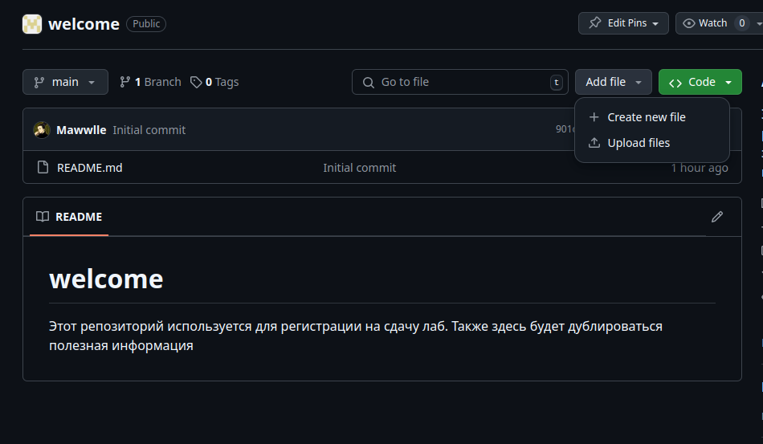
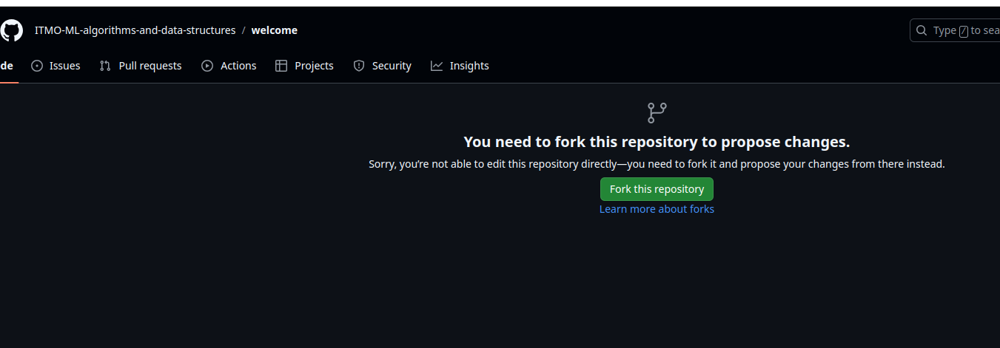
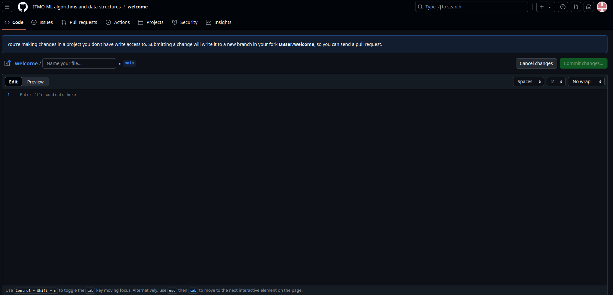
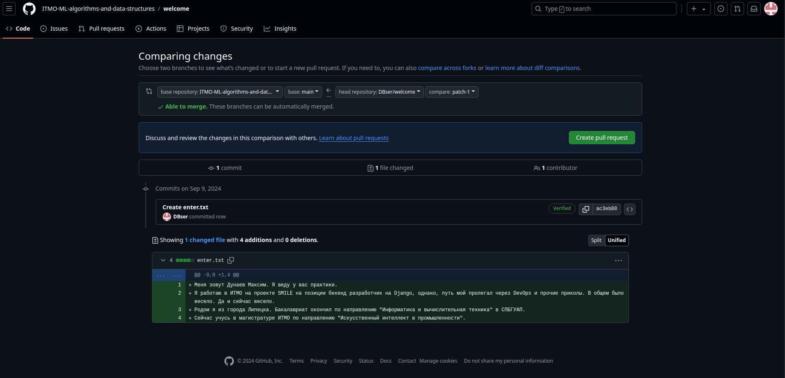
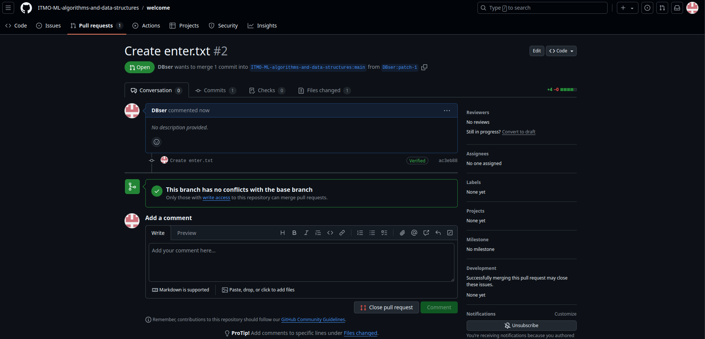

# welcome
Этот репозиторий используется для регистрации на сдачу лаб. Также здесь будет дублироваться полезная информация

# Регистрация
Добавьте файл **enter.txt**. В нём нужно добавить немного информации о себе. Кто вы и откуда, немного познакомимся :)  

## Вы не сможете добавить файл, поэтому для начала нужно создать форк.

## Здесь пишем о себе

## Здесь мы создаём Pull Request

### Pull Request мы называем понятным именем
Например, "Запрос на добавление Дунаев М.В поток 2"  

## Готово, после всех действий вы должны видеть следующее

Когда кто-то из преподавателей аппрувнет PR, вы получите доступ на полигон   
[Сюда тык для теста](https://github.com/ITMO-ML-algorithms-and-data-structures/polygon)
